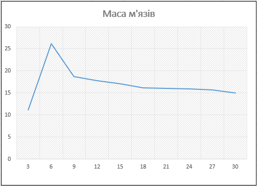
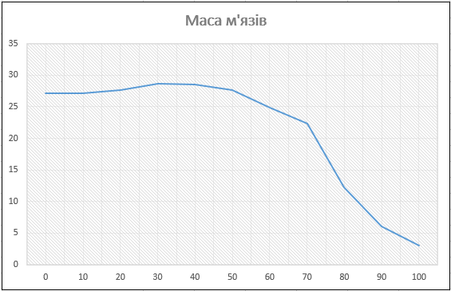
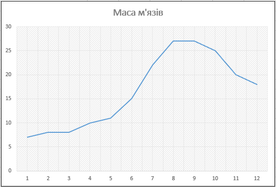

## Комп'ютерні системи імітаційного моделювання
## СПМ-23-3, **Мішенін Дмитро Олександрович**
### Лабораторна робота №**1**. Опис імітаційних моделей та проведення обчислювальних експериментів

 

### Варіант 12, модель у середовищі NetLogo:
[Muscle Development](http://www.netlogoweb.org/launch#http://www.netlogoweb.org/assets/modelslib/Sample%20Models/Biology/Muscle%20Development.nlogo)

 

### Опис моделі (Muscle Development):

​	Ця модель описує фізіологічні процеси, що відбуваються під час фізичних вправ, і допомагає зрозуміти, які фактори впливають на гормональний баланс, необхідний для нарощування м’язів при піднятті ваги. Серед важливих аспектів враховуються частота тренувань, достатнє відновлення, якісний сон, інтенсивність занять, а також генетичні особливості, такі як співвідношення повільних і швидких м’язових волокон. Успішний розвиток м’язів залежить від взаємодії цих факторів.

### Керуючі параметри:
- **lift** – цей параметр вказує, чи займається людина вправами, пов’язаними з підняттям ваги, і має вирішальне значення для приросту м’язової маси.
- **hours-of-sleep** – цей параметр показує, скільки годин сну отримує людина для відновлення м’язів. Від кількості сну залежить, як ефективно організм відновлюється і сприяє росту м’язів.
- **intensity** – параметр який визначає рівень зусиль, що докладаються під час тренувань у залі. Вища інтенсивність призводить до більшої втоми м’язових волокон, що стимулює їх зміцнення та зростання.
- **days-between-workouts** - визначає інтервали між тренуваннями. Від частоти тренувань залежить, чи отримує організм достатньо часу для повного відновлення м’язів.
- **%slow-twitch-fibers** -показує частку м’язових волокон із повільним скороченням, що впливає на витривалість і можливість м’язового розвитку, і визначається генетично.
### Внутрішні параметри:
- **fiber-size** – характеризує розмір окремих м’язових волокон.

- **hormone-diffuse-rate** – вказує на швидкість поширення гормонів між м’язовими волокнами, що впливає на загальний гормональний баланс.

- **catabolic** – гормони, що руйнують м’язові волокна, впливаючи на їхню масу та стан.

- **anabolic** – гормони, які сприяють росту та відновленню м’язової тканини.

- **muscle-mass** – показує загальний розмір м’язових волокон і враховує їхні зміни під впливом різних фізіологічних чинників.

  
### Показники роботи системи:
- **Muscle Development** – відображає зміну маси м’язових волокон на графіку
- .**Hormones** – показує графік виділення анаболічних і катаболічних гормонів.

### Додаткові відомості:

​	Перетренованість виникає, коли тіло не має достатнього часу для повного відновлення між тренуваннями. Це призводить до застою в м'язовому розвитку, а в деяких випадках навіть до втрати м'язової маси. Використання примітиву *log* у процедурах, які контролюють викид і баланс гормонів, дозволяє точніше відтворити природну тенденцію: кожна додаткова одиниця біологічного компонента викликає менші адаптивні зміни в системі, ніж попередня.

### Недоліки моделі:

​	У реальному житті можуть виникати непередбачені ситуації, що заважають дотримуватись ідеального графіка тренувань або сну. Модель не враховує таких випадкових обставин, як травми, зміни в робочому графіку або особисті обставини, які можуть зірвати тренування. Крім того, модель не розглядає важливі фактори, як-от якість і частоту харчування, які суттєво впливають на розвиток м’язів.

## Практична частина

### Обчислювальний експеримент №1 - Вплив частоти тренувань на ріст м'язів

Досліджується залежність росту м'язів протягом певної кількості тактів (200) від частоти тренувань.
Експерименти проводяться при 3-30 днів між тренуваннями, з кроком 3, усього 10 симуляцій.  
Інші керуючі параметри мають значення за замовчуванням:

- **lift**: on
- **hours-of-sleep**: 8
- **intensity**: 95
- **%slow-twitch-fibers**: 50

<table>
<thead>
<tr><th style="width:35px">Симуляція №</th><th>Проміжки між тренуваннями</th><th>Маса м'язів</th></tr>
</thead>
<tbody>
<tr><td>1</td><td>3</td><td>11,2</td></tr>
<tr><td>2</td><td>6</td><td>26,2</td></tr>
<tr><td>3</td><td>9</td><td>18,7</td></tr>
<tr><td>4</td><td>12</td><td>17,8</td></tr>
<tr><td>5</td><td>15</td><td>17,1</td></tr>
<tr><td>6</td><td>18</td><td>16,2</td></tr>
<tr><td>7</td><td>21</td><td>16</td></tr>
<tr><td>8</td><td>24</td><td>15,9</td></tr>
<tr><td>9</td><td>27</td><td>15,7</td></tr>
<tr><td>10</td><td>30</td><td>15</td></tr>
</tbody>
</table>

​	**Висновки :**  Аналіз результатів показав, що оптимальний інтервал між тренуваннями для максимального росту м'язів знаходиться в діапазоні 6-9 днів. У цьому проміжку м'язи мають достатньо часу для повного відновлення та адаптації, що дозволяє їм ефективно збільшуватися в розмірі та силі, уникаючи перетренованості. Завдяки цьому поєднанню навантаження і відпочинку досягається найвища м'язова маса в умовах, змодельованих у дослідженні.

### Обчислювальний експеримент №2 - Вплив відсотка м'язових волокон з повільним скороченням на ріст м'язів

Досліджується залежність росту м'язів протягом певної кількості тактів (200) від відсотка м'язових волокон з повільним скороченням.
Експерименти проводяться при 0-100 значення волокон, з кроком 10, усього 11 симуляцій.  
Інші керуючі параметри мають значення за замовчуванням:

- **lift**: on
- **intensity**: 95
- **hours-of-sleep**: 8
- **days-between-workouts**:5

<table>
<thead>
<tr><th style="width:35px">Симуляція №</th><th>Відсоток м'язових волокон з повільним скороченням</th><th>Маса м'язів</th></tr>
</thead>
<tbody>
<tr><td>1</td><td>0</td><td>27,2</td></tr>
<tr><td>2</td><td>10</td><td>27,2</td></tr>
<tr><td>3</td><td>20</td><td>27,6</td></tr>
<tr><td>4</td><td>30</td><td>28,6</td></tr>
<tr><td>5</td><td>40</td><td>28,5</td></tr>
<tr><td>6</td><td>50</td><td>27,6</td></tr>
<tr><td>7</td><td>60</td><td>24,8</td></tr>
<tr><td>8</td><td>70</td><td>22,3</td></tr>
<tr><td>9</td><td>80</td><td>12,3</td></tr>
<tr><td>10</td><td>90</td><td>6,1</td></tr>
<tr><td>11</td><td>100</td><td>3</td></tr>
</tbody>
</table>

​	**Висновки :**  Результати демонструють, що для досягнення найбільшого зростання м'язів оптимальний відсоток м'язових волокон із повільним скороченням становить приблизно 30-40%. Саме в цьому діапазоні спостерігається максимальне збільшення м'язової маси.

### Обчислювальний експеримент №3 - Вплив кількості годин сну на ріст м'язів.
Досліджується залежність росту м'язів протягом певної кількості тактів (200) від кількості годин сну.
Експерименти проводяться при 1-12 годин сну, з кроком 1, усього 12 симуляцій.  
Інші керуючі параметри мають значення за замовчуванням:
- **lift**: on
- **intensity**: 95
- **days-between-workouts**: 5
- **%slow-twitch-fibers**: 50

<table>
<thead>
<tr><th style="width:35px">Симуляція №</th><th>Годин сну</th><th>Маса м'язів</th></tr>
</thead>
<tbody>
<tr><td>1</td><td>1</td><td>7</td></tr>
<tr><td>2</td><td>2</td><td>8</td></tr>
<tr><td>3</td><td>3</td><td>8</td></tr>
<tr><td>4</td><td>4</td><td>10</td></tr>
<tr><td>5</td><td>5</td><td>11</td></tr>
<tr><td>6</td><td>6</td><td>15</td></tr>
<tr><td>7</td><td>7</td><td>22</td></tr>
<tr><td>8</td><td>8</td><td>27</td></tr>
<tr><td>9</td><td>9</td><td>27</td></tr>
<tr><td>10</td><td>10</td><td>25</td></tr>
<tr><td>11</td><td>11</td><td>20</td></tr>
<tr><td>12</td><td>12</td><td>18</td></tr>
</tbody>
</table>

​	**Висновки :**  Результати показують, що для досягнення максимального зростання м'язової маси оптимальна тривалість сну становить близько 8-9 годин. У цьому часовому діапазоні спостерігається найвища м'язова маса, що підкреслює важливість якісного і достатнього відпочинку для ефективного відновлення та росту м'язів. 

 

