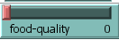
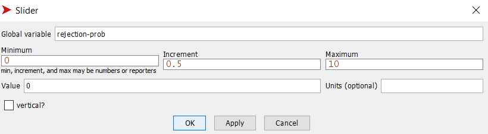
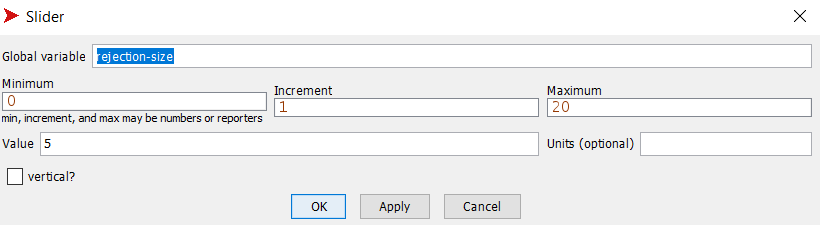
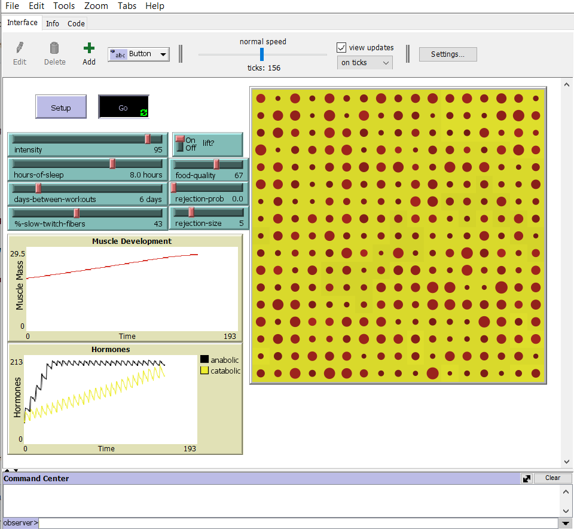
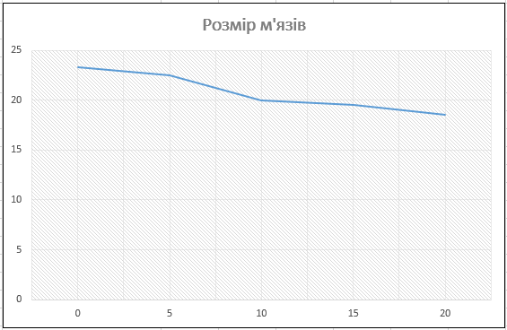

## Комп'ютерні системи імітаційного моделювання
## СПМ-23-3, **Мішенін Дмитро Олександрович**
### Лабораторна робота №**2**. Редагування імітаційних моделей у середовищі NetLogo

 

### Варіант 12, модель у середовищі NetLogo:
[Muscle Development](http://www.netlogoweb.org/launch#http://www.netlogoweb.org/assets/modelslib/Sample%20Models/Biology/Muscle%20Development.nlogo)

 

### 1. Внесені зміни у вихідну логіку моделі (за варіантом):

1.1 Додаємо у моделі вплив харчування на можливість зростання м'язової маси. Для цього створюємо параметр  **food-quality** - якість харчування. Додаємо слайдер для можливості змінювати якість харчування:

Додаємо процедуру **eat**. Порівнюється якість їжі з випадковим числом від 0 до 100. Якщо **food-quality** менше за це випадкове число, виконується перший блок коду, в якому зменшується кількіть анаболічних гормонів та росте кількість катаболічних. І в іншому випадку навпаки, що сприяє росту м'язів.
<pre>
 to eat
   ask muscle-fibers [
    ifelse food-quality < random-float 100 + food-quality / 10
    [
      set catabolic-hormone catabolic-hormone + food-quality / 15 * (log fiber-size 10)
      set anabolic-hormone anabolic-hormone - food-quality / 15 * (log fiber-size 10)
    ]
    [
      set catabolic-hormone catabolic-hormone - food-quality / 15 * (log fiber-size 10)
      set anabolic-hormone anabolic-hormone + food-quality / 15 * (log fiber-size 10)
    ]
  ]
end
</pre>

1.2 Додаємо регулюємі користувачем параметри, що визначають вірогідність та міру тимчасового відхилення від вказаних початкових значень інтенсивності тренувань, кількості годин сну та днів між тренуваннями до відхвилення.

<pre>
  rejection?     ;; чи сталось відхилення
  rejection-time ;; час який буде діяти відхилення
  intensity-temp
  hours-of-sleep-temp
  days-between-workouts-temp
</pre>

Додаємо нову процедуру **reject** яка відповідає за відхилення початкових значень. Час який буде діяти відхилення 20 днів (20 тіків). 
<pre>
to reject
  if rejection-time + 20 < ticks [
    ifelse rejection-prob > random-float 100
       [set rejection? true
        set rejection-time ticks]
       [set rejection? false]
       ifelse rejection?
       [ 
       		set intensity (intensity - (intensity / 100 * rejection-size)) 
            set hours-of-sleep (hours-of-sleep - (hours-of-sleep / 100 * rejection-size))  
            set days-between-workouts (days-between-workouts - (days-between-workouts / 100 * rejection-size))  
       ]
       [  
       		set intensity intensity-temp   
       		set hours-of-sleep hours-of-sleep-temp  
       		set days-between-workouts days-between-workouts-temp 
       ]  
   ]
end
</pre>

Слайдери, які контролюють вірогідність та міру тимчасового відхилення

### 2. Внесені зміни у вихідну логіку моделі (на власний розсуд):

2.1 Додаємо окремим м'язовим волокнам унікальну для кожного волокна характеристику **growth-rate** - швидкість зростання

Змінемо власні змінні м’язових волокон:
<pre>
 muscle-fibers-own [
  fiber-size   ;; different from built-in "size" because it uses different units
  max-size
  growth-rate
]
</pre>

Ініціалізація **growth-rate** для кожного м'язового волокна у межах від 0.9 до 1.1. Чим більше тим швидше ростуть м'язові волокна.
<pre>
 to new-muscle-fibers
 ***
      set growth-rate 0.9 + random-float 0.2
      regulate-muscle-fibers
    ]
  ]
 ***
end
</pre>
2.2 До процедури **new-muscle-fibers** додаємо вплив індивідуального випадкового зростання для кожного м'язового волокна.

<pre>
 to new-muscle-fibers
  ask patches [
    sprout-muscle-fibers 1 [
      set max-size 4
      ;; create a normalized distribution of maximum muscle fiber sizes
      ;; with median dependent on % of slow twitch fibers.
      repeat 20  [
        if random-float 100 > %-slow-twitch-fibers [
          set max-size max-size + 1
        ]
      ]
      ;; provide non-uniform starting sizes for varied results, everyone's different
      set fiber-size (0.2 + random-float 0.4) * max-size
      set growth-rate 0.9 + random-float 0.2
      regulate-muscle-fibers
    ]
  ]
end
</pre>

 

## 
### Обчислювальний експеримент - Вплив міри тимчасового відхилення на зростання м'язів

Досліджується залежність росту м'язів протягом певної кількості тактів (200) від розміру міри тимчасового відхилення.
Експерименти проводяться при 0-20 розміру у відсотках міри тимчасового відхилення, з кроком 5, усього 5 симуляцій.  
Інші керуючі параметри мають значення за замовчуванням:
- **lift**: on
- **intensity**: 95
- **food-quality**:75%
- **rejection-prob**: 5
- **hours-of-sleep**: 8
- **%slow-twitch-fibers**: 50
- **days-between-workouts**: 5

<table>
<thead>
<tr><th style="width:35px">Симуляція №</th><th>Міра тимчасового відхилення</th><th>Розмір м'язів</th></tr>
</thead>
<tbody>
<tr><td>1</td><td>0</td><td>23,3</td></tr>
<tr><td>2</td><td>5</td><td>22,5</td></tr>
<tr><td>3</td><td>10</td><td>20,0</td></tr>
<tr><td>4</td><td>15</td><td>19,5</td></tr>
<tr><td>5</td><td>20</td><td>18,5</td></tr>
</tbody>
</table>

​	**Висновок :** Графік наочно демонструє, що з підвищенням ступеня тимчасового відхилення спостерігається зменшення обсягу м'язів. Зокрема, при ступені відхилення 20 зафіксовано найменший обсяг м'язів у порівнянні з іншими варіантами.

 
